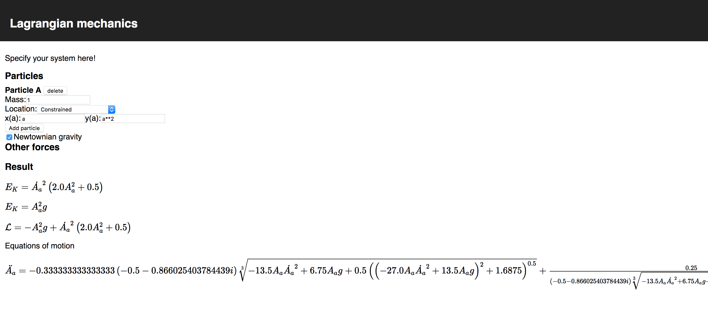

# lagrangian solver!

This app has:

- a physics module which takes a system of particles and solves the equations of motion using Lagrangian mechanics. It supports particles which are free, particles which are constrained to move on just one curve within 2D space, and particles which are connected by a stiff rod to another particle (as long as there are no cycles of stiff rods)
- a frontend to allow you to nicely specify these particles.

It looks like this:

